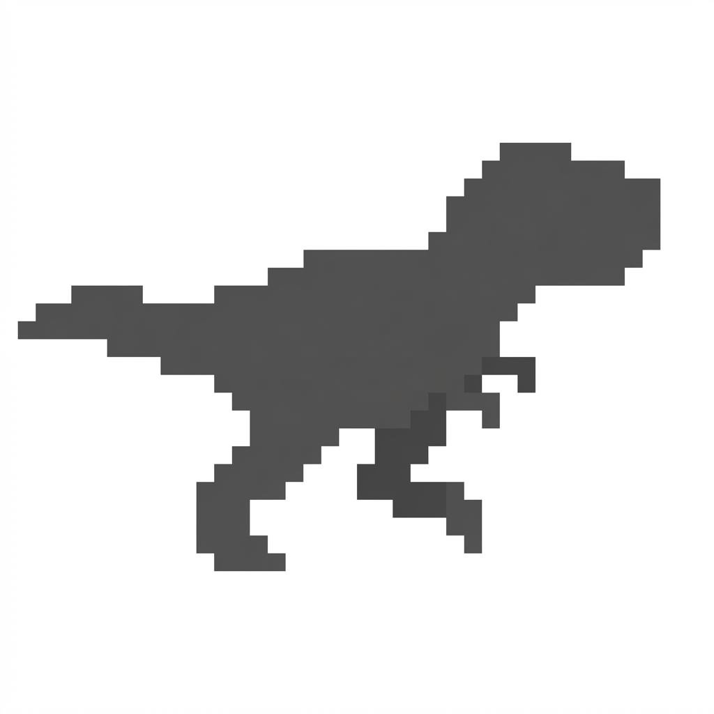

# Chrome Dino Game Replica (React)

A pixel-perfect clone of the iconic Chrome Dino game, built with React and Vite.

 
*(Note: Replace with actual screenshot path if available, or keep generic)*

## 🚀 Objectives / Scope
*   **Replica Development:** Build a functional, pixel-perfect clone of the iconic Chrome Dino game using modern web technologies.
*   **Gamification Logic:** Implement core game mechanics including infinite runner logic, collision detection, score throttling, and jump physics.
*   **Visual Fidelity:** Ensure high visual accuracy with custom pixel-art assets, retro typography, and responsive design.

## 💡 Findings / Insights
*   **Game Loop Optimization:** Utilized `requestAnimationFrame` for smooth rendering (60fps) and precise obstacle movement, avoiding laggy `setInterval` approaches.
*   **Algorithmic Spawning:** Implemented randomized obstacle generation with dynamic sizing and grouping (double obstacles) to enhance replayability.
*   **Asset Management:** Learned the importance of optimization; replaced SVG assets with custom-generated, transparent PNG sprites for better performance and aesthetic control.

## 🛠 Skills / Tools Used
*   **Tech Stack:** React (Hooks: `useState`, `useEffect`, `useRef`, `useCallback`), Vite.
*   **Styling:** CSS3 (Animations, Flexbox), Google Fonts (Press Start 2P).
*   **Development:** Git/GitHub for version control, Vercel for CI/CD deployment.
*   **Asset Creation:** Generative AI for pixel art sprites, Python (Pillow) for image processing/transparency.

## 🌟 Project Impact
*   **Deployed Application:** Successfully deployed a fully interactive game to Vercel, accessible instantly via web browser.
*   **User Experience:** Created a polished endless runner with retro aesthetics, high-score tracking, and intuitive controls, demonstrating strong frontend engineering capabilities.

## 📦 How to Run Locally

1.  **Clone the repository:**
    ```bash
    git clone https://github.com/vedansha07/Dino-Game.git
    cd Dino-Game
    ```

2.  **Install dependencies:**
    ```bash
    npm install
    ```

3.  **Start development server:**
    ```bash
    npm run dev
    ```

4.  Open `http://localhost:5173` in your browser.

## 📄 License
MIT
